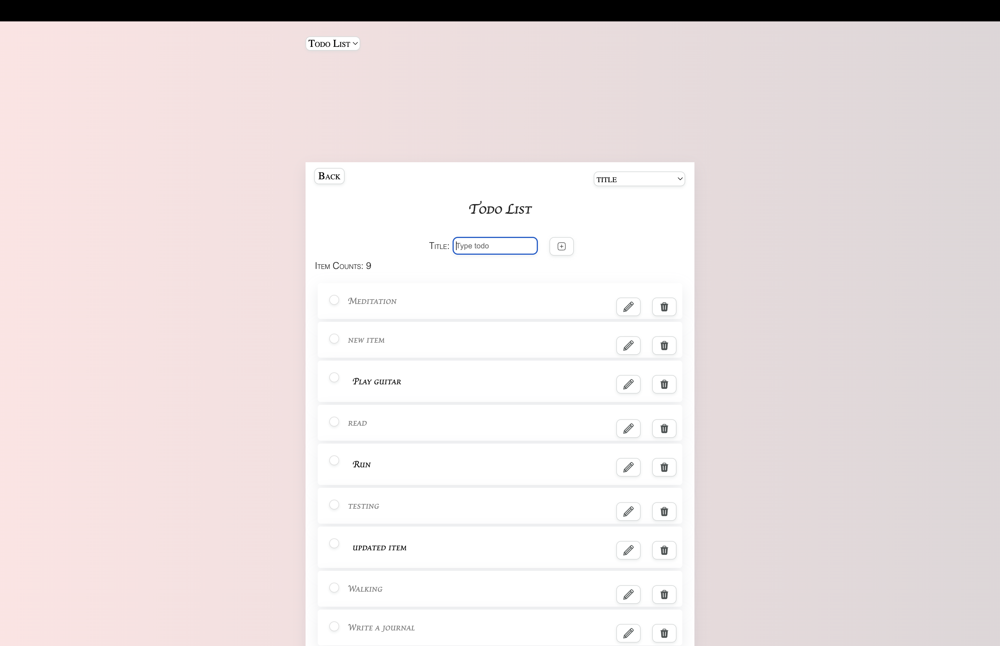

<p align="center">
  <a href="https://react-todo-wine-one.vercel.app">
    
  </a>
</p>
<h1 align="center" style="color: #fa9291;">
  React App: Your Task Tracker™
</h1>

[](https://github.com/DoinaFitchevici?screen_name=DoinaFitchevici)
[](https://react-todo-wine-one.vercel.app)
[](https://github.com/DoinaFitchevici/react-todo/graphs/contributors)
[](https://github.com/DoinaFitchevici/react-todo/network/members)
[](https://github.com/DoinaFitchevici/react-todo/stargazers)
[](https://github.com/DoinaFitchevici/react-todo/issues)
[](./LICENSE)



This is a Todo List application built using React.js.

- Creates, edits, marks as complete, and deletes tasks effortlessly.
- Filters tasks by status (completed or not) and sorts in ascending order.
- Easily tracks item count and switches between lists.

## Table of Contents

- [Getting Started](#getting-started)
- [Prerequisites](#prerequisites)
- [Installation](#installation)
- [Usage](#usage)
- [User Manual](#user-manual)
- [Additional Resources](#additional-resources)
- [Acknowledgments](#Acknowledgments)
- [Contact](#contact)
- [Author](#author)
- [License](#license)

## Getting Started

To get a local copy up and running follow these steps.

### Prerequisites

- npm

```sh
npm install npm@latest -g
```

> It updates npm to the latest version.

### Installation

- Clone the repo

```sh
SSH:
git clone git@github.com:DoinaFitchevici/react-todo.git

HTTPS:
git clone https://github.com/DoinaFitchevici/react-todo.git
```

- Install NPM packages

```sh
npm install
```

### Usage

To run the application, execute the following command:

```sh
npm start
```

The application will open in your default web browser at http://localhost:3000. You can add new todo items, edit, mark as complete, and delete them.

## User Manual

### How to add a new todo item?

1. Enter the title of your new todo item in the input box labeled "Title".

2. Next, click on the "Add" icon/button next to the input box to add a new todo item to the list.

### How to mark a todo item as completed?

1. Find the todo item that you want to mark completed in the list of todos.

2. Select the checkbox on the left of the todo item to mark it as complete.

### How to edit a todo item?

1. Find the todo item that you want to edit in the list of todos.

2. Click on the "Edit" icon/button that is located on the right side of the todo item.

> Note that the item will have the focus on.

3. Edit the item.

4. Click on the "Save" button/press ENTER to save the edited item.

### How to delete a todo item?

1. Find the todo item that you want to delete in the list of todos.

2. Click on the "Delete" icon/button that is located on the right side of the todo item.

3. The todo item will now be removed from the list.

> Please note that if the todo list is sourced from an API, consider incorporating a DELETE request to the API to remove the corresponding item.

## Additional Resources

- [React](https://react.dev/)
- [Learn React](https://scrimba.com/learn/learnreact)
- [The Road to React](https://www.roadtoreact.com/)
- [CSS Style in React](https://www.robinwieruch.de/react-css-styling/)
- [Markdown](https://www.markdownguide.org/)
- [Code The Dream organization](https://codethedream.org/)

## Acknowledgments

Special thanks and a shout out to the following individuals and organizations:

- [Code the Dream](https://www.codethedream.org/) for their exceptional coding school and amazing mentors, providing valuable learning resources and support.
- [SVGREPO](https://www.svgrepo.com) for the icons used in this project.
- Hat tip to anyone whose code was used.

## Contact

If you have any questions or feedback, feel free to reach out to my [LinkedIn](https://www.linkedin.com/in/doina-fitchevici/).

## Author

- [Doina Fitchevici](https://github.com/DoinaFitchevici)

## License

Distributed under the MIT License. See [`LICENSE`](./LICENSE) for more information.
